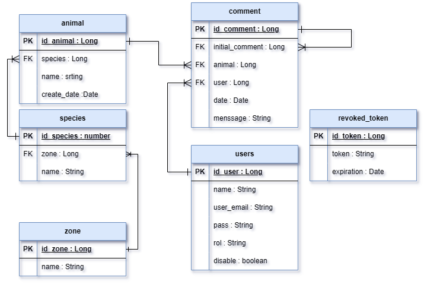

# API - ZOO 🦁🐘🦒🐒

This is the documentation for the API developed for managing comments and responses to animals in a zoo.

## **Getting started guide**

To start using this api you must perform the following steps:

- **Clone the github repository**


Use the following command to clone the remote repository

``` git
git clone https://github.com/leideryesidmm/Prueba-Tecnica-Nelumbo-Zoologico

 ```

- **Configure the environment**


**Use a code editor like IntelliJ IDEA**

Edit the environment variables in the aplication.properties as needed.

- DATABASE_URL: Is the url of your PostgreSQL database.

- DATABASE_USERNAME: PostgreSQL username

- DATABASE_PASSWORD: PostgreSQL password

- SECRET_KEY: This is the secret key that jwt will use to create the token.

- JPA_HIBERNATE_DDL_AUTO: This variable configures Hibernate's behavior for database schema management, such as creating, updating, validating, and dropping tables at application startup.


In the first execution of the project JPA_HIBERNATE_DDL_AUTO must have CREATE as the value to create the database schema (entities and relationships), then it should be changed to UPDATE.

Then run the following sql script to insert the admin user:

``` sql
INSERT INTO users(name, user_email, pass, role, disable) VALUES ('Admin Name','admin@mail.com', '$2a$10$jiOBIS1O06xpyNlk2z4ICOIjtptXs3uNiXd6eSmuccNZo8oTiIJvy', 'ADMIN',false);
 ```

**Using docker-compose**

If you want to run the project with docker-compose, run the following command from the root of the project:

``` bash
docker-compose up --build -d

 ```

- **Use the api**


## Authentication

This API uses JSON Web Tokens JWT for authentication and handles two user roles ("ADMIN", "EMPLEADO")

The request {{host}}/api/v1/auth/login generates the user token
The request {{host}}/api/v1/auth/logout invalidates the token by adding it to a table of invalid tokens

### CRON service
The service cleanUpExpiredTokens() removes tokens that have already been invalidated by the session close, this is executed at midnight.
 ``` Java
    @Scheduled(cron = "0 0 0 * * ?")
    @Transactional
    public void cleanUpExpiredTokens() {
        Date now = new Date();
        System.out.println(now);
        revokedTokenRepository.deleteByExpirationBefore(now);
    }
 ```
### Authentication error response

If the user is not registered or does not have the user role permissions, the API will return an HTTP status 403 Forbidden Error, indicating that it does not have the permissions to make the rquest.

## MER from the database

